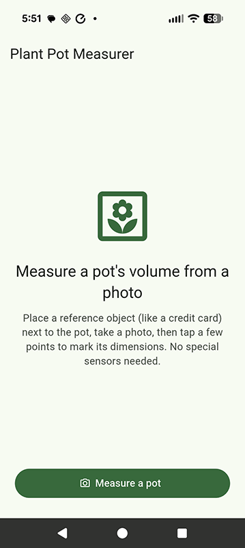
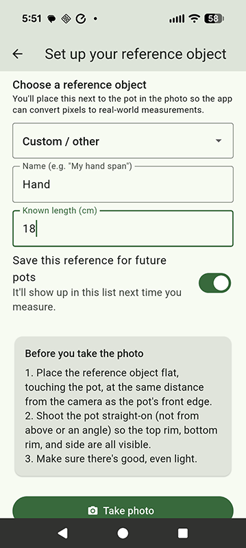
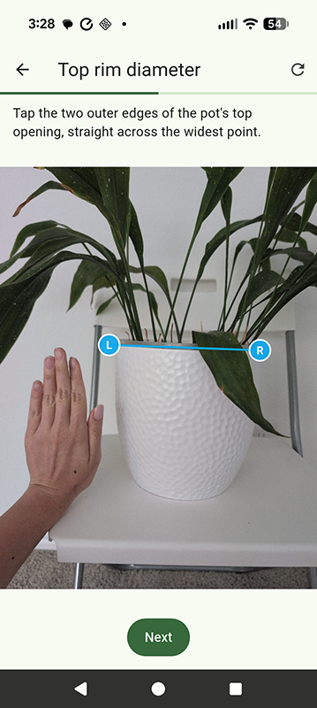
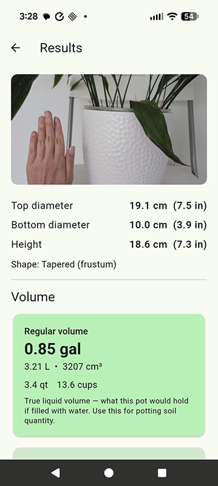
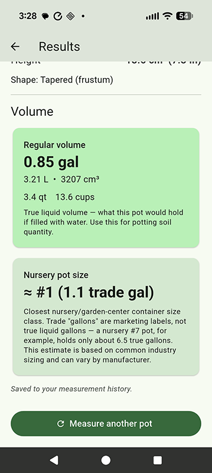
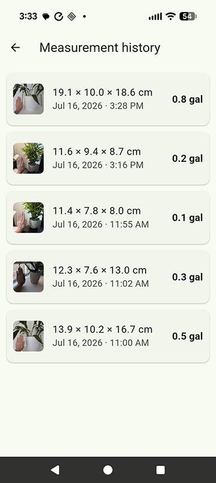

# Plant Pot Measurer

Using a reference object, you can take a picture of a pot and measure its dimensions, then have the volume calculated in liquid gallons and nursery gallons. Some pots are measured in (liquid) gallons, and some are measured in nursery gallons. With this, you'll be able to easily compare pot sizes

This app was made in Flutter with the help of Claude Code.

## How to Run
Run `flutter pub get`

View Command Palette > Select Device

Press F5 to run

## Screencaps

I measured the length of my hand so it'll be easy to use as a reference when measuring pot size.

Measure the top rim diameter, bottom rim diameter, and height

